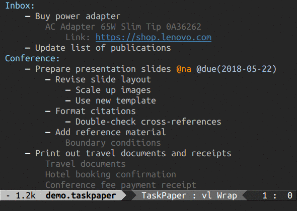

# Emacs TaskPaper Mode [![MELPA][melpa-badge]][melpa-link]

TaskPaper mode is an Emacs major mode for working with files in TaskPaper format. The format was invented by Jesse Grosjean and named after his [TaskPaper][taskpaper] macOS app, which is a system for organizing your outlines and tasks in a text file. The format itself is exceptionally readable and supports different item types, outline hierarchy, and tagging.

TaskPaper format knows about four things: _projects_, _tasks_, _notes_, and _tags_. Items can be indented (using literal tabs) under other items to create outline structure, which defines parent-child hierarchical relationship:

    Project meeting:
        - Select and invite participants @next
        - Prepare and distribute meeting agenda
        - Book conference room @due(2018-06-20)
            Room M-2612
        - Print handouts for attendees @done(2018-05-11)
        - Review meeting notes @waiting

The file format is fairly simple:

- Files are expected to use the UTF-8 encoding and use `\n` to separate lines.

- Each line makes a new item: project, task, or note.

- A task is a line that begins with a hyphen (`-`) followed by a space, which can optionally be prefixed (i.e. indented) with tabs. A task can have zero or more tags anywhere on the line (not just trailing at the end).

- A project is a line that isn't a task and ends with a colon (`:`) followed by a newline. Tags can exist after the colon, but if any non-tag text is present, then it won't be recognized as a project.

- A note is any non-blank line that doesn't match the task or project rules. A note can have zero or more tags anywhere on the line.

- A tag consists of an at symbol (`@`) preceded by a space and followed by a tag name. Tags can optionally have a value in parentheses after the tag name.

Indentation level (with tabs, not spaces) defines ownership. For instance, if you indent one task under another task, then it is considered a subtask. Projects, tasks, and notes own all items that are indented underneath them. The nesting level can go as deep as you need it to be. Empty lines are ignored when calculating ownership.

The system doesn't force any particular system on you; it provides basic list making elements for you to use as you see fit. See the [TaskPaper User's Guide][taskpaper-guide] for more details.

TaskPaper mode is implemented on top of Outline mode. Visibility cycling and structure editing help to work with the outline structure. Special commands also provided for outline filtering, tags manipulation, sorting, refiling, and archiving of items. For querying a collection of TaskPaper files, TaskPaper mode also includes a powerful agenda mode.

Documentation for TaskPaper mode is available below, but you can also use Emacs' help commands to access the built-in documentation. Documentation strings to each function are available via `C-h f` (`describe-function`), individual key bindings can be investigated with `C-h k` (`describe-key`), and a complete list of key bindings is available using `C-h m` (`describe-mode`).

This document explains the installation, usage, and basic customization of TaskPaper mode package. For more advanced customization, hacking and scripting see the [Scripting Guide][tp-mode-scripting-guide].

# Contents

- [Installation and Activation](#installation-and-activation)
- [Usage](#usage)
    - [Formatting Items](#formatting-items)
    - [Folding](#folding)
    - [Outline Navigation](#outline-navigation)
    - [Structure Editing](#structure-editing)
    - [Tagging](#tagging)
    - [Completing Actions](#completing-actions)
    - [Calendar Integration](#calendar-integration)
    - [Date and Time Formats](#date-and-time-formats)
    - [Hyperlinks and Inline Images](#hyperlinks-and-inline-images)
    - [Inline Formatting](#inline-formatting)
    - [Sorting](#sorting)
    - [Filtering](#filtering)
    - [Searching](#searching)
    - [Refiling](#refiling)
    - [Archiving](#archiving)
    - [Multi-Document Support and Agenda View](#multi-document-support-and-agenda-view)
    - [Miscellaneous](#miscellaneous)
- [Customization](#customization)
    - [Syntax Highlighting](#syntax-highlighting)
    - [Cleaner Outline View](#cleaner-outline-view)
    - [Indentation Guides](#indentation-guides)
- [Acknowledgments](#acknowledgements)
- [Bugs](#bugs)
- [License](#license)

# Installation and Activation

## Using Package Manager

The recommended way to install TaskPaper mode is to install the package from [MELPA][melpa] using `package.el`. First, configure `package.el` and the MELPA repository by adding the following to your init file:

    (require 'package)
    (add-to-list 'package-archives
                 '("melpa" . "https://melpa.org/packages/"))
    (package-initialize)

Then, after restarting Emacs or evaluating the above statements, issue the following command: `M-x package-install RET taskpaper-mode RET`.

Alternatively, if you manage loading packages with `use-package.el` then you can automatically install and configure TaskPaper mode by adding a declaration such as this one to your init file:

    (use-package taskpaper-mode :ensure t)

## Direct Download

Download `taskpaper-mode.el` and save the file where Emacs can find it (i.e., a directory in your `load-path`). Copy the following into your init file:

    (require 'taskpaper-mode)

Files with the `.taskpaper` extension use TaskPaper mode by default. If you want other filenames to be associated with TaskPaper mode, add the corresponding entry to the `auto-mode-alist` in your init file:

    (add-to-list 'auto-mode-alist
                 '("\\.todo\\'" . taskpaper-mode))

# Usage

## Formatting Items

In TaskPaper mode each line makes a new item. The following commands auto-format and indent you items as you type.

- `RET`: Create a new item with the same level as the one under cursor (`taskpaper-new-item-same-level`).

- `M-RET`: Create a new task with the same level as the item under cursor (`taskpaper-new-task-same-level`).

The following commands change the type of the current item.

- `C-c C-f p`: Format item under cursor as project (`taskpaper-item-format-as-project`).

- `C-c C-f t`: Format item under cursor as task (`taskpaper-item-format-as-task`).

- `C-c C-f n`: Format item under cursor as note (`taskpaper-item-format-as-note`).

## Folding

You can expand and collapse parts of the outline to control the level of detail that you see.

The main folding command `C-TAB` (`taskpaper-cycle`) changes the visibility of items in the buffer cycling through the most important states. The action of the command depends on the current cursor location.

When point is at the beginning of the buffer, rotate the entire buffer among the two states:

- Overview: Only top-level items are shown.
- Show All: Everything is shown.

When point is in an item, rotate current subtree among the three states:

- Folded: Only the main item is shown.
- Children: The item and its direct children are shown. From this state, you can move to one of the children and zoom in further.
- Subtree: The entire subtree under the item is shown.

When Emacs first visits a TaskPaper file, the global state is set to Show All, i.e., all items are visible. This can be configured through the user option `taskpaper-startup-folded`.

The command `C-c *` (`taskpaper-outline-hide-other`) lets you focus on the current item under cursor. It hides everything except the current item with its ancestors and direct children. Other top-level items are shown to give an overview of the general document structure.

The command `C-c C-z` (`taskpaper-outline-overview`) switches to Overview state showing only top-level items.

The command `C-c C-a` (`taskpaper-outline-show-all`) switches to Show All state unfolding all items at all levels (also bound to `ESC ESC`).

## Outline Navigation

The following commands jump to other items in the buffer.

- `C-DOWN`: Go to the next item with the same level (`taskpaper-outline-forward-same-level`).

- `C-UP`: Go to the previous item with the same level (`taskpaper-outline-backward-same-level`).

- `S-UP`: Go to the parent item (`taskpaper-outline-up-level`).

- `C-c C-j`: Go to selected item (`taskpaper-goto`).

The command `C-c C-j` (`taskpaper-goto`) prompts the user for an outline path to an item offering standard minibuffer completion for possible target locations. Special completion packages like [Ivy][emacs-ivy] or [Icicles][emacs-icicles] provide faster and more convenient way to select an outline path in minibuffer using regexp or fuzzy matching and incremental narrowing of possible selections. Additionally, you can use [Imenu][emacs-imenu] to go to a specific project in the buffer.

To assist navigation in long documents the command `C-c :` (`taskpaper-item-display-outline-path`) shows the current outline path in the echo area.

## Structure Editing

Outlines allow a document to be organized in a hierarchical structure. The structure editing commands let you easily rearrange the order and hierarchy of items in the outline.

Four main commands are provided for structure editing. The commands work on the current subtree (the current item plus all its children) and are assigned to the four arrow keys pressed with a modifier (META by default) in the following way.

- `M-LEFT`: Promote the subtree under cursor by one level (`taskpaper-outline-promote-subtree`).

- `M-RIGHT`: Demote the subtree under cursor by one level (`taskpaper-outline-demote-subtree`).

- `M-UP`: Move the subtree under cursor up past the previous same-level subtree (`taskpaper-outline-move-subtree-up`).

- `M-DOWN`: Move the subtree under cursor down past the next same-level subtree (`taskpaper-outline-move-subtree-down`).

The commands `M-LEFT` (`taskpaper-outline-promote-subtree`) and `M-RIGHT` (`taskpaper-outline-demote-subtree`) change the current subtree to a different outline level — i.e. the level of all items in the tree is decreased or increased. Note that the scope of "current subtree" may be changed after a promotion.

The commands `M-UP` (`taskpaper-outline-move-subtree-up`) and `M-DOWN` (`taskpaper-outline-move-subtree-down`) move the entire current subtree (folded or not) past the next same-level subtree in the given direction. The cursor moves with the subtree, so these commands can be used repeatedly to "drag" a subtree to the wanted position.

Additionally, the commands `TAB` (`taskpaper-outline-promote`) and `S-TAB` (`taskpaper-outline-demote`) promote/demote single item under cursor.

TaskPaper mode also provides following additional commands for working with subtrees (folded or not):

- `C-c #`: Narrow buffer to the subtree under cursor (`taskpaper-narrow-to-subtree`).

- `C-c C-m`: Mark the subtree under cursor (`taskpaper-mark-subtree`).

- `C-c C-x v`: Copy all visible items in region to the kill ring and clipboard (`taskpaper-outline-copy-visible`).

- `C-c C-x C-w`: Cut the subtree under cursor into the kill ring (`taskpaper-cut-subtree`).

- `C-c C-x M-w`: Copy the subtree under cursor into the kill ring (`taskpaper-copy-subtree`).

- `C-c C-x C-c`: Duplicate the subtree under cursor (`taskpaper-clone-subtree`).

- `C-c C-x C-y`: Paste the subtree from the kill ring as child of the current item (`taskpaper-paste-subtree`).

## Tagging

In addition to the hierarchical ways of organizing your actions, you can also assign any number of tags to each task, project, or note. Tags provide another way to organize (and later query for) items. You can add tags for start and due dates, priorities, people, locations, effort estimates, and more.

To create a tag type the `@` symbol preceded by a space and followed by a tag name with no spaces. Tag names may basically contain uppercase and lowercase letters, digits, hyphens, underscores, and dots. Tags can optionally have a value (or list of comma separated values) in parentheses after the tag name:

- `@today`
- `@effort(0.5)`
- `@priority(1)`
- `@due(2018-08-19)`
- `@status(in press)`

The value text inside can have whitespaces, but no newlines. If you need to include parentheses in the tag value, precede them with a backslash.

If an item has a certain tag, all its subitems will inherit that tag. To limit tag inheritance to specific tags, configure the user option `taskpaper-tags-exclude-from-inheritance`.

After `@` symbol `M-TAB` offers in-buffer completion on tag names. The list of tags is created dynamically from all tags used in the current buffer. If your desktop intercepts the key binding `M-TAB` to switch windows, use `C-M-i` or `ESC TAB` as an alternative or customize your environment.

In addition to the in-buffer completion TaskPaper mode also implements another tag selection method called _fast tag selection_. This allows you to select your commonly used tags with just a single key press. For this to work you should assign unique, case-sensitive, letters to most of your commonly used tags. You can do this by configuring the user option `taskpaper-tag-alist` in your init file:

    (setq taskpaper-tag-alist
          '(("today"       . ?t)
            ("due(%%)"     . ?d)
            ("due(%%+7d)"  . ?s)
            ("priority(1)" . ?1)
            ("priority(2)" . ?2)
            ("priority(3)" . ?3)))

Pressing `C-c @` (`taskpaper-item-set-tag-fast-select`) will then present you with a special interface, listing all predefined tags with corresponding selection keys.

Tag specifiers can have value in parentheses. If the tag value begins with `%%` the following time string will be expanded into an absolute date in [ISO 8601][iso8601-wiki] format. E.g., if today is May 8, 2018, the tag specifier `due(%%+2d)` will expand to `@due(2018-05-10)`, i.e., in two days from now. See [Date and Time Formats](#date-and-time-formats) section below for date & time formats you can use here. This way you can create handy presets for often used relative dates based on your average routine. If after stripping the leading `%%` the tag value is empty, the user will be prompted for time stamp using interactive date & time prompt.

The command `C-c C-r` (`taskpaper-remove-tag-at-point`) deletes single tag under cursor.

Following tags have special meaning in TaskPaper mode:

- `@done`: To-do items can be marked as completed by applying the `@done` tag to them (see the [Completing Actions](#completing-actions) section).
- `@search`: The `@search` tags are used to store search queries on per-document basis (see the [Storing Queries](#storing-queries) section).
- `@project`: The `@project` tags are used to store original project hierarchy of archived items (see the [Archiving](#archiving) section).

## Completing Actions

Actionable items can be marked as completed by applying the `@done` tag. The command `C-c C-d` (`taskpaper-item-toggle-done`) toggles done state for item under cursor. Alternatively, you can toggle done state of the task by clicking on the task mark with `mouse-1` if the user option `taskpaper-pretty-marks` is non-nil. If the user option `taskpaper-complete-save-date` is non-nil, current date will be added to the `@done` tag. See the documentation string of `taskpaper-complete-save-date` for possible options. Additionally, you may specify a list of tags, which will be removed once the item is completed, using the user option `taskpaper-tags-to-remove-when-done`. When the item is marked as completed, the hook `taskpaper-after-completion-hook` is run.

By default, items tagged with `@done` are visually crossed out. You can change the way completed items are displayed by customizing `taskpaper-done-item-face` or disable the additional fontification of these items completely by configuring the user option `taskpaper-fontify-done-items`.

## Calendar Integration

The Emacs calendar created by Edward M. Reingold displays a three-month calendar with holidays from different countries and cultures. Following commands provide some integration with the calendar.

- `C-c SPC`: Display current date or date under cursor in calendar (`taskpaper-show-in-calendar`).

- `C-c >`: Access the calendar at the current date or date under cursor (`taskpaper-goto-calendar`).

- `C-c <`: Insert a time stamp corresponding to the cursor date in the calendar (`taskpaper-date-from-calendar`).

- `C-c .`: Prompt for a date and insert a corresponding time stamp (`taskpaper-read-date-insert-timestamp`).

The command `C-c >` (`taskpaper-goto-calendar`) goes to the calendar at the current date. If point is on a tag with value, the command interprets it as date and goes to this date instead. With a `C-u` prefix, the command always goes to the current date.

The command `C-c .` (`taskpaper-read-date-insert-timestamp`) prompts for the date & time to insert at point. You can enter a date using date & time syntax described below. The current interpretation of your input will be displayed live in the minibuffer, right next to your input. If you find this distracting, turn the display off with the user option `taskpaper-read-date-display-live`.

Parallel to the minibuffer prompt the current interpretation of your input is tracked in the calendar window (see the user option `taskpaper-read-date-popup-calendar`). You can control the calendar from the minibuffer using the following commands:

- `RET`: Choose date at cursor in calendar.

- `mouse-1`: Select date by clicking on it.

- ` >` / `<`: Scroll calendar forward/backward by one month.

- `C-.`: Go to the current date.

- `!`: Mark diary items in calendar.

## Date and Time Formats

Dates and times are an essential part of any task management system. You can store dates and times in tag values and perform date search `[d]` on them (see the [Searching](#searching) section) to remind yourself of e.g., upcoming deadlines or scheduled activities. These examples show the different formats that you can use when entering dates and times in the date & time prompt. The same formats can be used for date & time values in tags.

    - Do weekly review @due(Friday 12:30)
    - Attend meeting @due(2017-08-11 8am)

If the time string is unparseable, current time is returned.

### Dates

Dates resolve to midnight of the given date.

- `2017`
- `2017-5`
- `2017-05-10`
- `--05-10`
- `2017-W02`
- `2017-W02-5`
- `this week`
- `last month`
- `next quarter`
- `next Friday`
- `last June 5`
- `June`
- `today`
- `tomorrow`
- `yesterday`

TaskPaper mode understands English month and weekday abbreviations. If you enter the name of a specific time period, the date will be at its beginning. So `June` without date means June first. Week refers to [ISO 8601][iso8601-wiki] standard week that starts on Monday, not Sunday.

You can refer to relative dates using common words (`today`, `tomorrow`, `yesterday`, `last week`, etc.). Words `this`, `next`, and `last` have specific meanings: `this Friday` always means the Friday in this week, `next Friday` always means the Friday in the next week, and `last Friday` always means the Friday in the last week, regardless of what day today is. Other units work in the same way.

### Times

Times are relative to the current date.

- `6am`
- `6:45pm`
- `12:45`
- `now`

### Duration Offsets

Duration offsets are relative to the current time.

- `+5min`
- `+2h`
- `-1d`
- `-4w`
- `+2m`
- `+2q`
- `+1y`
- `+5 minutes`
- `+2 hours`
- `-1 day`
- `-4 weeks`
- `+2 months`
- `+2 quarters`
- `+1 year`
- `+3 Wed`

The shorthands `min`, `h`, `d`, `w`, `m`, `q`, and `y` stand for minute, hour, day, week, month, quarter, and year, respectively. Positive numbers stand for the future whereas negative numbers stand for the past. In case of weekdays the date will be the nth such day, e.g., `+2 Tue` means the second Tuesday from now.

### Combinations

You can combine dates, times, and duration offsets:

- `tomorrow at 8am`
- `2017-08-19 21:00`
- `2017 Jan 10 14:25`
- `today +2m +2d 5pm`

The time string is evaluated from left to right.

### Recurring Actions

When you need tasks that repeat themselves on a regular basis, you can set a recurring due date. Use relative dates in your tag values, and then do a date based search (see the [Searching](#searching) section). Here are a few examples of recurring tasks:

    - Due everyday @due(today)
    - Due on each Tuesday @due(Tue)
    - Due on at the Monday start of each week @due(this week)
    - Due on the 1st of each month @due(this month)
    - Due on the 15th of each month @due(this month +15d)

It doesn't cover all cases, but may work for you. For more flexible recurrence setup see the corresponding scripting example in the [Scripting Guide][tp-mode-scripting-guide].

Note: Recurring appointments like any other event that takes place at a specific time would do best in your calendar because you cannot act on them until that moment.

## Hyperlinks and Inline Images

TaskPaper mode auto-creates clickable hyperlinks when it recognizes link text. Below are some examples of the plain links that will be recognized.

- `http://www.example.org/index.html`
- `mailto:username@example.net`
- `file:filename.txt`
- `./filename.txt`
- `file:///home/username/filename.txt`
- `/home/username/filename.txt`
- `file:/username@host:filename.txt`
- `/username@host:filename.txt`

Absolute file links are starting with `/` or `~/`. Relative file links starting with `./` or `../` are relative to the location of your TaskPaper file. Spaces in file links must be protected using backslash, e.g., `./my\ file.txt`. By default, file links to non-existing local files highlight red.

The command `C-c C-l` (`taskpaper-insert-file-link-at-point`) inserts a plain file link at point offering standard minibuffer completion to select the name of the file. The path to the file is inserted relative to the directory of the current TaskPaper file, if the linked file is in the current directory or in a subdirectory of it, or if the path is written relative to the current directory using `../`. Otherwise an absolute path is used, if possible with `~/` for your home directory. You can force an absolute path with `C-u` prefix.

TaskPaper mode also has experimental support for inline [Markdown][markdown-wiki] links in form `[Link description](destination)`:

- `[URL](http://www.example.org/index.html)`
- `[File](file:///home/username/filename.txt)`
- `[Email](mailto:username@example.net)`

This descriptive syntax is useful for long links which can interrupt reading. If markup hiding is enabled (see the [Customization](#customization) section), only the description part is displayed as hyperlink making the link more readable. You can hover the mouse pointer over the description text to see the destination part. The destination part can include up to two levels of balanced, nested parentheses. Spaces in file links must be backslash-escaped.

Links inside projects and tasks are supported although not encouraged.

If the point is on a link the command `C-c C-o` or `mouse-1` (`taskpaper-open-link-at-point`) will launch a web browser for URLs (using `browse-url`) or start composing a mail message (using `compose-mail-other-window`). Furthermore, it will visit text and remote files in file links with Emacs and select a suitable application for local non-text files. Classification of files is based on file extension only. For non-specified extensions the system command to open files, like `open` on MS Windows and macOS, or the command specified in the mailcaps on GNU/Linux will be used. For more details see the user options `taskpaper-file-apps` and `taskpaper-open-non-existing-files`.

The command `C-c C-x C-v` (`taskpaper-toggle-inline-images`) toggles the inline display of linked images within the buffer skipping images larger than specified by `max-image-size`. Large images may be scaled down to fit in the buffer by setting the user option `taskpaper-max-image-size`. Resizing works in Emacs v25 or higher built with ImageMagick support. You can ask for inline images to be displayed at startup by configuring the user option `taskpaper-startup-with-inline-images`.

## Inline Formatting

You can use [Markdown][markdown-wiki] syntax for inline emphasis in notes. Text enclosed by single asterisk (`*`) or underscore (`_`) characters is emphasized. Double `*` or `_` produces strong emphasis:

    Emphasis with *asterisks* or _underscores_.
    Strong emphasis with **asterisks** or __underscores__.

You can use whichever style you prefer; the only restriction is that the same character must be used as opening and closing emphasis delimiter. A `*` or `_` character surrounded by whitespaces, or backslash-escaped, will not trigger emphasis. By default, emphasis will be displayed in italic while strong emphasis will be displayed in bold face.

The span of the emphasis is limited to a single item. Emphasis and strong emphasis can be nested. Inline emphasis inside projects and tasks is supported although not encouraged.

If you often use the asterisk or underscore in a different context, you can disable the interpretation of these characters by configuring the user option `taskpaper-use-inline-emphasis`.

## Sorting

The following commands sort same-level items. When point is at the beginning of the buffer, the top-level items are sorted. When point is in an item, the children of the current item are sorted. Sorting is case-insensitive. A `C-u` prefix will reverse the sort order.

- `C-c C-s a`: Sort same-level items alphabetically (`taskpaper-sort-alpha`).

- `C-c C-s t`: Sort same-level items by item type (`taskpaper-sort-by-type`).

When sorting is done, the hook `taskpaper-after-sorting-items-hook` is run. When children are sorted, hook functions are called with point on the parent item.

To meet more complex needs you can define your own sorting functions as described in the [Scripting Guide][tp-mode-scripting-guide].

## Filtering

Filtering hides items that don't match the search creating a sparse tree, so that the entire document is folded as much as possible, but the selected information is made visible along with the outline hierarchy above it to provide minimal context.

The command `C-c /` (`taskpaper-occur`) prompts for a [regexp][emacs-regexp] and creates a sparse tree with all matches. Each match is also highlighted. You can jump to the next/previous match in the buffer using the commands `M-g n` (`next-error`) and `M-g p` (`previous-error`). The highlights disappear when the buffer is changed by an editing command, or after pressing `C-c C-c`.

The command `C-c C-a` (`taskpaper-outline-show-all`) unfold all items at all levels (also bound to `ESC ESC`).

## Searching

You can create a sparse tree based on specific combinations of items' assigned tags and attributes. This is a great tool that lets you focus on the right things at the right time. For example, it allows you to get a filtered view of specific items grouped by same context or see which tasks should be done soon and which are overdue.

TaskPaper mode has a special mode for incremental querying. The I-query mode is entered by pressing `C-c C-i` (`taskpaper-iquery`). Query results are updated instantly as you type, creating a sparse tree with all matches. The command `C-c C-q` (`taskpaper-query`) is a non-incremental querying command, which requires you to type the entire query string before searching begins. This form of static, one-time querying (as opposed to incremental, on-the-fly querying) may be preferable in some situations, such as over slow network connections or on unusually large and deeply nested outlines, which may affect search responsiveness. You can limit your searches to a certain subtree or region by narrowing the buffer with `C-c #` (`taskpaper-narrow-to-subtree`) or `C-x n n` (`narrow-to-region`) respectively.

If your query has a formatting error the query string highlights red in the minibuffer. In addition to the standard motion and editing commands both static and incremental query modes define some additional key bindings while in minibuffer. Pressing `TAB` while editing query string offers completion on attribute names at point (see below). Pressing `C-c C-c` clears the query string and displays all items in the outline. Pressing `ESC ESC` or `C-g` quits the I-query mode while preserving the outline view.

By default, incremental query results are not updated immediately every time you press a key. Instead, the query is evaluated after a certain period of idle time (one tenth of a second, by default). If you would like to change this behavior, customize the user option `taskpaper-iquery-delay`. For example, when working on long documents over a slow network connections increasing the delay may give you a better search "responsiveness". To disable the delay entirely set the `taskpaper-iquery-delay` value to zero:

    (setq taskpaper-iquery-delay 0)

If the point is on a tag the command `C-c C-t` or `mouse-1` (`taskpaper-query-tag-at-point`) queries the buffer based on that tag. When cursor is on the `@search` tag, it evaluates the embedded query stored in the tag value (see the [Storing Queries](#storing-queries) section). For other tags when cursor is on the tag name, it queries for the tag name, otherwise for the name and associated value.

The query language syntax is described below.

__Note:__ Though the query language syntax described here represents a valid subset of search syntax implemented in TaskPaper v3 app (with some minor exceptions), the search behavior is slightly different. TaskPaper mode does not support the item path syntax and set operations in search queries evaluating tag inheritance instead.

### Tags and Attributes

Every item in the outline has its own set of attributes. Explicit attributes are associated with assigned tags and have the same names, e.g., the tag `@priority(1)` added to an item will be translated to an attribute named "priority" whose value is "1". And vice versa, setting an explicit attribute programmatically will change the corresponding tag. TaskPaper mode also includes some implicit (built-in) read-only attributes, which are not associated with tags and set in other way:

- `type`: Item's type (project, task, or note)
- `text`: Item's full line of text sans indentation

### Predicates

Search predicates describe what you are looking for. The full predicate pattern looks like this:

    @<attribute> <relation> [<modifier>] <search term>

Predicates start with the attribute, whose value or existence you want to test. Attribute represents tag with the same name or one of the implicit attributes and search term will be compared with the tag value. Pressing `TAB` offers completion on attribute names at point in both static and incremental query modes. Attribute names are always treated as case sensitive.

Relations determine the test that the predicate performs:

- `=`: True if the attribute and search term are equal
- `<`: True if the attribute is less than the search term
- `>`: True if the attribute is greater than the search term
- `<=`: True if the attribute is less than or equal to the search term
- `>=`: True if the attribute is greater than or equal to the search term
- `!=`: True if the attribute and search term are not equal
- `~=`: True if the attribute matches the search term
- `contains`: True if the attribute contains the search term
- `beginswith`: True if the attribute begins with the search term
- `endswith`: True if the attribute ends with the search term
- `matches`: True if the attribute matches the search term (same as `~=`)

The default type of comparison is case-insensitive string comparison. You can change this behavior by providing a modifier after the relation. The available modifiers are:

- `i`: Case insensitive string compare (the default)
- `s`: Case sensitive string compare
- `n`: Numeric compare
- `d`: Date compare
- `l`: List compare (can be combined with other modifiers)

Search terms can contain multiple words in sequence. Leading and trailing whitespaces are removed and multiple inter-word whitespaces collapsed into to a single space. If you want to search for an exact word or phrase preserving whitespaces, enclose the search term in double quotes. If some words or symbols are part of the predicate syntax or Boolean operators ("and", "or", "not", "matches", "@", etc.), they must be enclosed in double quotes. To include a double-quote character in a quoted search term, precede it with a backslash. If no search term is provided, attribute's presence will be tested.

In case of numeric compare `[n]` both sides of the compare are converted to numbers before comparing. This means `01` will equal to `1`, which is not true when doing the default string compare.

In case of date compare `[d]` both sides of the compare are converted to time values before comparing. The date & time format is described in the [Date and Time Formats](#date-and-time-formats) reference section.

With the list modifier `[l]` present both sides are converted to lists (comma separated) before comparing. Other modifiers can precede the list modifier making the search more specific.

In case of string compare `contains` will return matches if the right side is a substring of the left side. In case of list compare `contains` will return matches if the right side is a subset of the left side. For instance the search predicate `@value contains[nl] 10,20` will match an item, which has the tag `@value(2,10,18,20,22)`.

In case of string compare `matches` will return matches if the left side matches the right side converted to a [regular expression][emacs-regexp]. In case of list compare `matches` will return matches if the left side is a subset of the right side. For instance the search predicate `@value matches[nl] 10,20,22` will match an item, which has the tag `@value(10,22)`.

Here are some examples for predicates:

- `@today`
- `@type = note`
- `@due <=[d] +10d`
- `@priority >[n] 3`
- `@amount <[n] 1.2e3`
- `@text endswith ?`
- `@text matches "v[.0-9]"`
- `@text contains[s] new logo`
- `@value contains[nl] 10,20`
- `@text contains "this is not what I want"`
- `@text contains "\"Winter\" by A. Vivaldi"`

You don't need to enter the entire predicate pattern every time you search. Predicates use default values when part of the pattern is missing. Attribute defaults to `text` and relation defaults to `contains`. For example the following predicates are equal:

- `Inbox`
- `@text Inbox`
- `contains Inbox`
- `@text contains Inbox`
- `@text contains[i] Inbox`

### Boolean Expressions

You can combine predicates with Boolean `and`, `or`, and `not` operators:

    @due <=[d] +14d and not @done or @today

Binary logical `and` binds more strongly than `or`. Unary logical `not` binds more strongly than both `and` and `or`. You can use parentheses to explicitly denote precedence by grouping parts of your query that should be evaluated first:

    @due <=[d] +14d and not (@done or @hold)

### Shortcuts

It's common to search TaskPaper items based on their type: project, task, or note.

For example you might want to find the "Inbox" project. The default way to do this would be:

    @type = project and Inbox

TaskPaper mode adds a shortcut for type based searches. The shortcut version of this search is:

    project Inbox

These are the shortcut forms and what they expand to:

- `project` expands to `@type = project and`
- `task` expands to `@type = task and`
- `note` expands to `@type = note and`

### Storing Queries

You can embed search queries in a TaskPaper document using `@search` tags. This is a handy way to manage search queries on per-document basis. Note that the parenthesis escaping rule must be followed:

    Searches:
        Next action @search(@next and not @done)
        Active tasks @search(task and not \(@done or @hold\))

The command `C-c ?` (`taskpaper-query-read-select`) lets the user select a query offering standard minibuffer completion. Query description will be derived from the item's text. If the user option `taskpaper-custom-queries` is set (see below), its entries will be added to the possible selections. Special completion packages like [Ivy][emacs-ivy] or [Icicles][emacs-icicles] provide faster and more convenient way to select a query in minibuffer using regexp or fuzzy matching and incremental narrowing of possible selections.

Fast selection interface allows you to save your commonly used search queries and later select them with just a single key press. For this to work you should assign unique, case-sensitive, letters (or other characters, e.g., numbers) to your saved queries. You can do this by configuring the user option `taskpaper-custom-queries` in your init file:

    (setq taskpaper-custom-queries
          '((?w "Waiting"  "@waiting and not @done")
            (?d "Due Soon" "@due <=[d] +14d and not @done")
            (?o "Overdue"  "@due <[d] today and not @done")))

The initial value in each item defines the key you have to press. The second parameter is a short description and the last one is the query string to be used for the matching. If the first parameter is a string, it will be used as block title to visually group queries. Pressing `C-c !` (`taskpaper-query-fast-select`) will then present you with a special interface, listing all predefined queries with corresponding selection keys.

By default, predefined (embedded and custom) queries will be evaluated in non-incremental querying mode. If you want to use incremental mode for predefined queries, configure the user option `taskpaper-iquery-default`.

### Startup View

You can configure certain queries to be executed automatically when visiting a TaskPaper file. E.g., you can ask for all leaf notes (notes, which may contain other notes, but no task or project items) to be folded at startup by adding following to your init file:

    (add-hook 'taskpaper-mode-hook
              '(lambda () (taskpaper-query "not @type = note")))

## Refiling

When reorganizing your outline, you may want to refile or to copy some of the items into a different subtree. Cutting, finding the right location, and then pasting the item can be a cumbersome task, especially for large outlines with many sublevels. In addition to other structure editing commands (see the [Structure Editing](#structure-editing) section) the following special commands can be used to simplify this process:

- `C-c C-w`: Move the subtree under cursor to different (possibly invisible) location (`taskpaper-refile-subtree`).

- `C-c M-w`: Copy the subtree under cursor to different (possibly invisible) location (`taskpaper-refile-subtree-copy`).

The commands `C-c C-w` and `C-c M-w` offer possible target locations via outline path completion. This is the interface also used by the `C-c C-j` goto command.

The subtree is filed below the target item as a subitem. Depending on `taskpaper-reverse-note-order` setting, it will be either the first or last subitem.

## Archiving

When a project represented by a subtree is finished, you may want to remove the tree from the main outline by moving it to a dedicated archive location. This will keep your working outline clean and give you better visibility of all the remaining uncompleted actions. The archived items are out of the way, but accessible if you ever need to refer back to them.

The command `C-c C-x a` (`taskpaper-archive-subtree`) archives the subtree starting at the cursor position to the location given by `taskpaper-archive-location`. The default archive location is a file in the same directory as the current file, with the name derived by appending `_archive.taskpaper` to the current file name without extension. You can also choose what item to file archived items under. For details see the documentation string of the user option `taskpaper-archive-location`. The subtree is filed below the target item as a subitem. Depending on `taskpaper-reverse-note-order` setting, it will be either the first or last subitem. When the user option `taskpaper-archive-save-context` is non-nil, a `@project` tag with project hierarchy is added to the archived item.

When archiving the hook `taskpaper-archive-hook` runs after successfully archiving a subtree. Hook functions are called with point on the subtree in the original location. At this stage, the subtree has been added to the archive location, but not yet deleted from the original one.

## Multi-Document Support and Agenda View

For querying a collection of TaskPaper files, TaskPaper mode includes a powerful agenda mode. In this mode items from different TaskPaper files can be collected based on search queries and displayed in an organized way in a special agenda buffer. This buffer is read-only, but provides commands to visit the corresponding locations in the original TaskPaper files. In this way, all information is stored only once, removing the risk that your agenda view and agenda files may diverge.

The information to be shown is normally collected from all agenda files, the files listed in the user option `taskpaper-agenda-files`:

    (setq taskpaper-agenda-files '("~/tasks/"))

If a directory is part of this list, all files with the extension `.taskpaper` in this directory will be part of the list. You can customize the user option `taskpaper-agenda-file-regexp` to change this behavior. If the user option `taskpaper-agenda-skip-unavailable-files` is non-nil, agenda mode will silently skip unavailable agenda files without issuing an error.

The following commands enter the agenda mode. The command `taskpaper-agenda-search` prompts the user for a search query. The command `taskpaper-agenda-select` let the user select a predefined query via the custom query dialog described above. You may consider to assign global key bindings to these commands in your init file:

    (global-set-key (kbd "C-c a") 'taskpaper-agenda-search)
    (global-set-key (kbd "C-c s") 'taskpaper-agenda-select)

Two user options control how the agenda buffer is displayed and whether the window configuration is restored when the agenda exits: `taskpaper-agenda-window-setup` and `taskpaper-agenda-restore-windows-after-quit`. For details see the documentation strings of these user options.

### Sorting Agenda Items

Before being inserted into an agenda buffer, the items are sorted. Sorting can be customized using the user option `taskpaper-agenda-sorting-predicate`. If the variable is `nil`, which is the default setting, agenda items just appear in the sequence in which they are found in the agenda files. The sorting predicate function is called with two arguments, the items to compare, and should return non-nil if the first item should sort before the second one.

In the example below items will be sorted according to their due dates. The sorting is done by date & time value (converted to float number of seconds since the beginning of the epoch). Items, which have no or empty `@due` tag, are assumed to have 2100-12-12 as due date, effectively ending up at the bottom of the sorted list.

    (setq taskpaper-agenda-sorting-predicate
          '(lambda (a b)
              (setq a (or (taskpaper-string-get-attribute a "due")
                          "2100-12-12")
                    b (or (taskpaper-string-get-attribute b "due")
                          "2100-12-12"))
              (taskpaper-time< a b)))

Items with equal sort keys maintain their relative order before and after the sort, which means, the `taskpaper-agenda-sorting-predicate` option can be accommodated to order items according to different criteria.

### Motion and Display Commands

Items in the agenda buffer are linked back to the TaskPaper file where they originate. You are not allowed to edit the agenda buffer itself, but commands are provided to show and jump to the original item location.

- `n` or `DOWN`: Move to the next line (`taskpaper-agenda-next-line`).

- `p` or `UP`: Move to the previous line (`taskpaper-agenda-previous-line`).

- `SPC`: Display the original location of the item in another window (`taskpaper-agenda-show`).

- `L`: Display the original location in another window and recenter that window (`taskpaper-agenda-show-recenter`).

- `TAB`: Go to the original location of the item in another window (`taskpaper-agenda-goto`).

- `RET`: Go to the original location of the item and delete other windows (`taskpaper-agenda-switch-to`).

- `F`: Toggle Follow mode (`taskpaper-agenda-follow-mode`). In Follow mode, as you move the cursor through the agenda buffer, the other window always shows the corresponding location in the original TaskPaper file. The initial setting for this mode in new agenda buffers can be set with the user option `taskpaper-agenda-start-with-follow-mode`.

- `c`: Display date under cursor in calendar (`taskpaper-show-in-calendar`).

- `>`: Access calendar for the date under cursor (`taskpaper-goto-calendar`).

The command `SPC` (`taskpaper-agenda-show`) runs the hook `taskpaper-agenda-after-show-hook` after an item has been shown from the agenda. Hook functions are called with point in the buffer where the item originated. Thus, if you want to display only the current item, its ancestors and top-level items, put this in your init file:

    (add-hook 'taskpaper-agenda-after-show-hook
              'taskpaper-outline-hide-other)

### Filtering Agenda Items

You can also querying the agenda view to further narrow your search. Following commands and key bindings are defined in the agenda buffer:

- `I`: Query agenda buffer using I-query mode (`taskpaper-iquery-mode`).

- `Q`: Query agenda buffer non-interactively (`taskpaper-query`).

- `S`: Query agenda buffer using custom query selection dialog (`taskpaper-query-fast-select`).

- `t`: Show a filtered view of the items that contain the tag under cursor (`taskpaper-query-tag-at-point`).

- `/`: Prompt for a regexp and show a filtered view with all matches highlighted (`taskpaper-occur`).

- `C-c C-c`: Remove highlights (`taskpaper-occur-remove-highlights`).

- `a`: Show all items (`taskpaper-outline-show-all`).

### Other Agenda Commands

- `o`: Delete other windows (`delete-other-windows`).

- `v`: Copy all visible items in region to the kill ring and clipboard (`taskpaper-outline-copy-visible`).

- `r`: Recreate the agenda buffer (`taskpaper-agenda-redo`). Useful to reflect changes after modification of original TaskPaper files.

- `q`: Quit agenda and remove the agenda buffer (`taskpaper-agenda-quit`).

- `x`: Exit agenda and remove the agenda buffer and all buffers loaded by Emacs for the compilation of the agenda (`taskpaper-agenda-exit`). Buffers created by the user to visit TaskPaper files will not be removed.

## Miscellaneous

All the rest which did not fit elsewhere.

- `M-x taskpaper-save-all-taskpaper-buffers RET`: Save all TaskPaper mode buffers without user confirmation.

- `M-x taskpaper-outline-normalize-indentation RET`: Normalize outline indentation.

- `M-x taskpaper-mode-version RET`: Show TaskPaper mode version in the echo area.

- `M-x taskpaper-mode-manual RET`: Browse TaskPaper mode user's manual.

# Customization

Although no configuration is necessary there are a few things that can be customized in addition to the options mentioned above. All configurations can be performed either via Emacs' Easy Customization Interface or by modifying Emacs' init files directly.

## Syntax Highlighting

You may specify special faces for specific tags using the user option `taskpaper-tag-faces`. For example:

    (setq taskpaper-tag-faces
          '(("start" . "green")
            ("today" . font-lock-warning-face)
            ("due"   . (:foreground "red" :weight bold))))

A string is interpreted as a color. The option `taskpaper-faces-easy-properties` determines if that color is interpreted as a foreground or a background color. For more details see the documentation string of the user option `taskpaper-tag-faces`.

Note: While using a list with face properties as shown for `due` _should_ work, this does not always seem to be the case. If necessary, define a special face and use that.

Additionally, the faces used for syntax highlighting can be modified to your liking by issuing `M-x customize-group RET taskpaper-faces RET`.

You can activate the task marks by setting the user option `taskpaper-pretty-marks` to non-nil, which makes the task marks appear as UTF-8 characters. This does not change the underlying buffer content, but it overlays the UTF-8 character _for display purposes only_. Tasks can then be marked as done by clicking on the task mark with `mouse-1`. The overlay characters for the task marks can be customized using the `taskpaper-bullet` and `taskpaper-bullet-done` user options.

You can hide inline markup elements like emphasis delimiters by configuring the user option `taskpaper-hide-markup`. The underlying buffer content remains unchanged, but the markup elements will be hidden. Markup hiding can be toggled using `C-c C-x C-m` (`taskpaper-toggle-markup-hiding`).

## Cleaner Outline View

The `adaptive-wrap.el` sets the `wrap-prefix` correctly for indenting and wrapping of long-line items. The version included in this repository provides the `adaptive-wrap-prefix-mode` minor mode, which sets the `wrap-prefix` property on the fly so that single-long-line paragraphs get word-wrapped in a way similar to what you'd get with `M-q` using `adaptive-fill-mode`, but without actually changing the buffer's text. The present version supports tabs, works on one-line paragraphs, and can be used in modes other than TaskPaper mode. In can be activated globally by putting `adaptive-wrap-mode.el` on the load path and adding to your init file

    (require 'adaptive-wrap)
    (add-hook 'visual-line-mode-hook
              '(lambda () (adaptive-wrap-prefix-mode 1)))
    (global-visual-line-mode 1)

## Indentation Guides

If you want to display indentation guides in TaskPaper mode windows I recommend the [highlight-indent-guides.el][emacs-highlight-indent-guides] package. To enable it automatically when entering TaskPaper mode, you can use the `taskpaper-mode-hook`:

    (add-hook 'taskpaper-mode-hook
              '(lambda () (highlignt-indent-guides-mode 1)))

For customizing the way guides are displayed, see the package options.

# Acknowledgments

Thanks to Jesse Grosjean for writing [TaskPaper app][taskpaper] for macOS, whose functionality and sleekness I wanted to bring to Emacs, and for publishing TaskPaper's [open source model layer][birch-outline], which gave me some valuable implementation insights.

I would also thank the following people, from whose work TaskPaper mode has benefited greatly:

- Carsten Dominik, Bastien Guerry and other Org mode developers for creating and maintaining [Org mode][emacs-orgmode] for Emacs, from which ideas and implementation I borrowed liberally;

- Stephen Berman and Stefan Monnier for writing the original version of [adaptive-wrap.el][emacs-adaptive-wrap].

# Bugs

TaskPaper mode is developed and tested primarily for compatibility with GNU Emacs 24.3 and later. If you find any bugs in TaskPaper mode, please construct a test case or a patch and open a ticket on the [GitHub issue tracker][github-issues].

# License

This program is free software; you can redistribute it and/or modify it under the terms of the GNU General Public License as published by the Free Software Foundation; either version 3, or (at your option) any later version.

This program is distributed in the hope that it will be useful, but WITHOUT ANY WARRANTY; without even the implied warranty of MERCHANTABILITY or FITNESS FOR A PARTICULAR PURPOSE. See the GNU General Public License for more details.

You should have received a copy of the GNU General Public License along with this program. If not, see <http://www.gnu.org/licenses/>.

[melpa-badge]: https://melpa.org/packages/taskpaper-mode-badge.svg

[melpa-link]: https://melpa.org/#/taskpaper-mode

[taskpaper]: https://www.taskpaper.com/

[taskpaper-guide]: https://guide.taskpaper.com/getting-started/

[tp-mode-scripting-guide]: ./scripting.md

[melpa]: https://melpa.org

[emacs-ivy]: https://github.com/abo-abo/swiper

[emacs-icicles]: https://www.emacswiki.org/emacs/Icicles

[emacs-imenu]: https://www.gnu.org/software/emacs/manual/html_node/emacs/Imenu.html

[iso8601-wiki]: https://en.wikipedia.org/wiki/ISO_8601

[markdown-wiki]: https://en.wikipedia.org/wiki/Markdown

[emacs-regexp]: https://www.gnu.org/software/emacs/manual/html_node/elisp/Regular-Expressions.html

[emacs-highlight-indent-guides]: https://github.com/DarthFennec/highlight-indent-guides

[emacs-orgmode]: http://orgmode.org/

[emacs-adaptive-wrap]: https://elpa.gnu.org/packages/adaptive-wrap.html

[birch-outline]: https://github.com/jessegrosjean/birch-outline

[github-issues]: https://github.com/saf-dmitry/taskpaper-mode/issues

